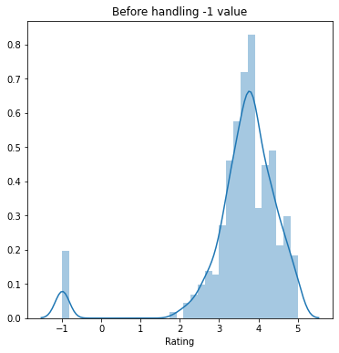
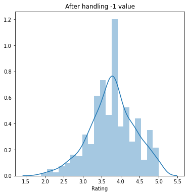
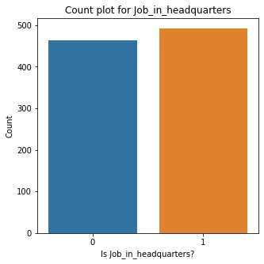
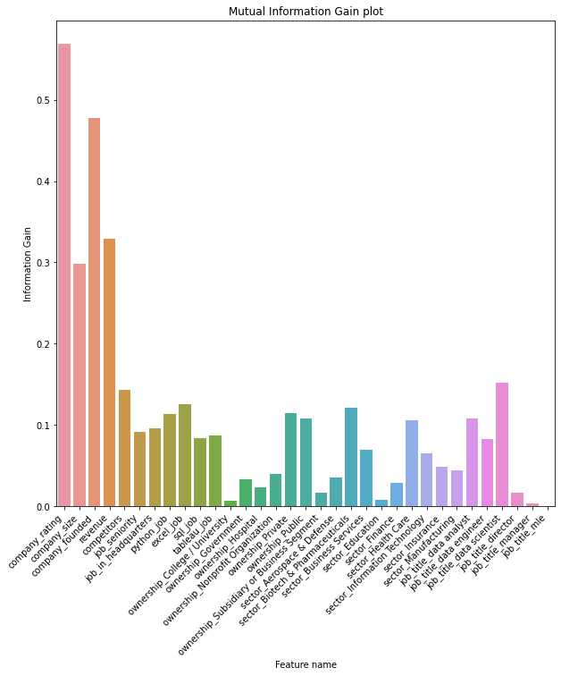
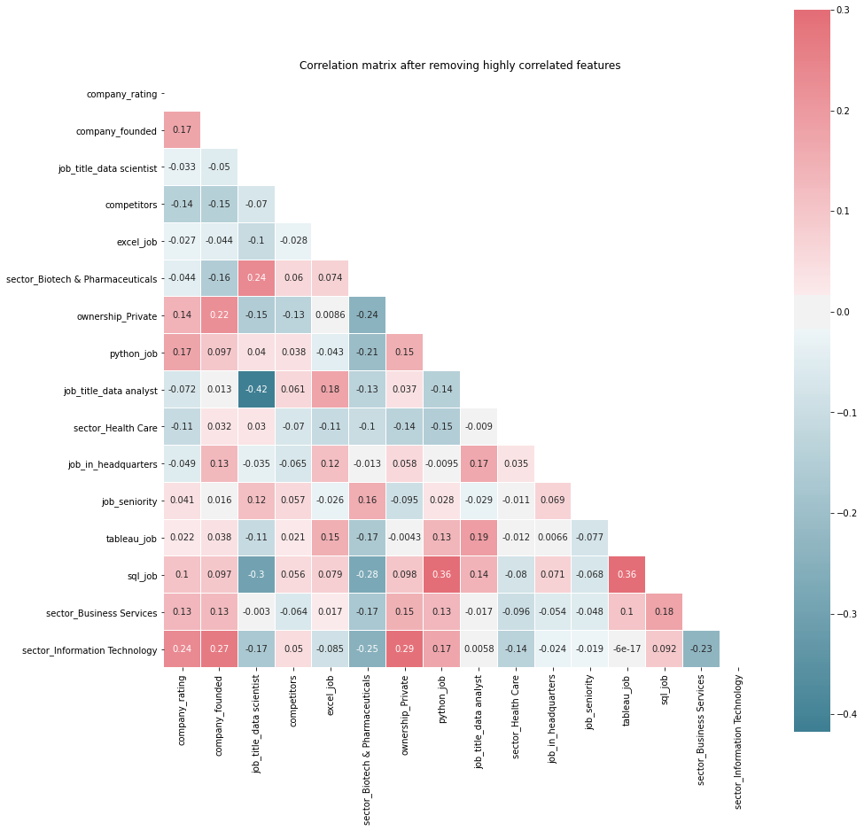
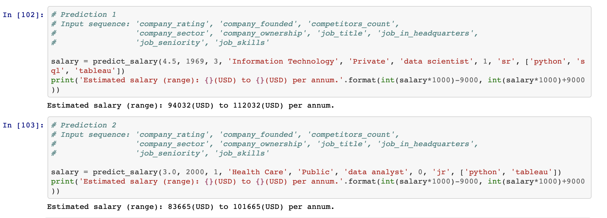

# Salary machine learning model
A machine learning model that  **estimates salary of data scientist**

## Overview

The machine learning model implemented by Jupyter to estimate data scientists' salaries based on features such as ratings, company establishment, etc. Design features from the text of each job description to quantify the value of the company to python, excel, tableau and SQL

## How will this project help?
• This project **helps data scientist/analyst to negotiate their income for an existing or a new job**

## Installation
* Requires Python running version 3.6 or higher
* Install jupyter package `pip install jupyter`

## Resources Used
• Packages: **pandas, numpy, sklearn, matplotlib, seaborn.** 
• Dataset by **Ken Jee**: https://github.com/PlayingNumbers/ds_salary_proj

## Exploratory Data Analysis (EDA) and Data Cleaning
• **Removed unwanted columns**: 'Unnamed: 0' 
• **Plotted bar graphs and count plots** for numerical and categorical features respectively for EDA 
• **Numerical Features** (Rating, Founded): **Replaced NaN or -1 values with mean or median based on their distribution** 
  
• **Categorical Features: Replaced NaN or -1 values with 'Other'/'Unknown' category** 
• **Removed unwanted alphabet/special characters from Salary feature** 
• **Converted the Salary column into one scale** i.e. from (per hour, per annum, employer-provided salary) to (per annum)

## Feature Engineering
• **Creating new features** from existing features e.g. **job_in_headquaters from (job_location, headquarters)**, etc. 
 
• Trimming columns i.e., **Trimming features having more than 10 categories to reduce the dimensionality** 
• **Handling ordinal and nominal categorical features** 
• Feature Selection using **information gain (mutual_info_regression) and correlation matrix** 

 
 
• Feature Scaling using **StandardScalar**

## Model Building and Evaluation
Metric: Negative Root Mean Squared Error (NRMSE) 
• Multiple Linear Regression: -27.523 
• Lasso Regression: -27.993 
• **Random Forest: -17.637** 
• Gradient Boosting: -24.429 
• Voting (Random Forest + Gradient Boosting): -19.136 
_**Note: Evaluation scores are obtained using  cross-validation.**_

## Model Prediction

